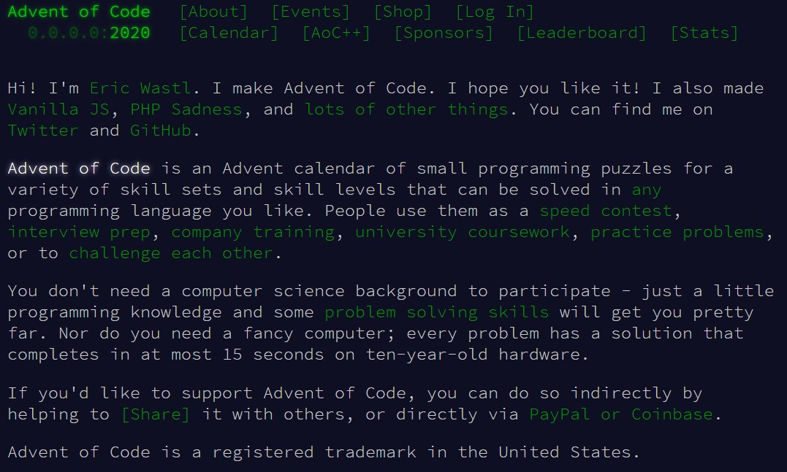

# [Advent of Code](https://adventofcode.com)

It's exam season, so I don't know if I'll be able to keep up!  

_Note to self_:

1.  `mkdir ./{year}/day-{x}-{problem}/`
2.  `source ./load-cookie.sh && ./get-input.py`

